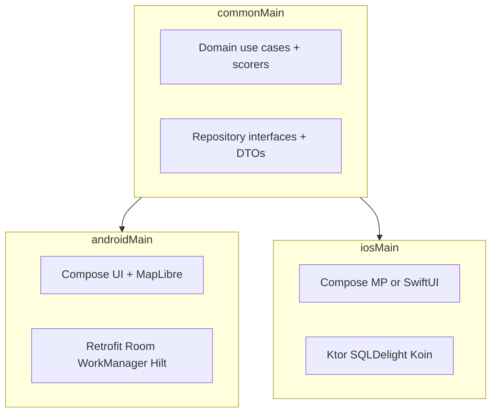

# Concierge Weather Recommender

## a. Project Overview 📱
This is a native Android app that implements the Concierge Weather Recommender assignment brief: search for a city and see a **7-day forecast** in the sheet under the map — a full-width row of tall day buttons (weather + date, today first and selected) plus a vertical column of ranked activities (Skiing, Surfing, Outdoor sightseeing, Indoor sightseeing) for the selected day's Open-Meteo forecast. Several polish features below are **stretch** beyond a minimal brief and should be scored as such.

| Scope | What |
|-------|------|
| **Core (brief)** | City search, **7-day selector (weather + date per day)**, per-day activity ranking, offline-first Room cache, Clean Architecture + tests |
| **Stretch** | Home top picks (postcard cards + Top Picks / Recent tabs); History (10 cities, Room `lastViewedAt`, id dedupe); Marine API; Wikipedia city thumbnails (Room v8 `imageUrl` + 30-day `placeMetadataUpdatedAt`); WorkManager sync; pull-to-refresh; dark mode + **persisted theme toggle**; splash + original mark; share 9:16 weather flyer PNG (+ city-image background, save to Downloads); collapsing square (1:1) MapLibre map (map-first hop, then sheet); GPS current-location chip; nearby-city prefetch; Paparazzi + instrumented CI |

Key experience details:
- **7-Day Forecast (core)**: the detail sheet (bottom half under the 1:1 map) is a **no-scroll** weighted layout: city hero, then **seven tall day-of-week buttons in one `fillMaxWidth` row** (weekday + date stacked, weather icon, high/low, precip — no activity name/score on the chip). Today is first and selected (`selectedDayIndex = 0`). Tapping a day re-ranks the **vertical activity column** below. There is no "7-day forecast" heading and no "Wednesday's picks" title.
- **Per-day recommendations**: ranked activities fill leftover height as equal-weight **cards in a column** (icon + name + score + a localized **why** line from `ReasonKey`). There is no single "week-long" score.
- **Geography-aware activities**: activities that don't make sense for a location are hidden entirely (e.g. surfing is only offered where there is sea access; skiing only in mountainous terrain or when snow is falling).
- **Home "top picks"**: vertical postcard cards (city name, best activity, temp; Wikipedia thumbnail when available), behind a **Top Picks / Recent** tab row (stretch). Pull-to-refresh on home (assignment **bonus**) force-refreshes this feed — only when the sheet is scrolled to the top **and** the collapsing map header is fully expanded (`modifier.pullToRefresh` `enabled`). Detail has no PTR.
- **Recently viewed History**: the **Recent** tab lists up to 10 cities the user explicitly opened (search, top-pick, or map tap). Persisted via Room `lastViewedAt`; Nominatim/GeoNames id collisions are collapsed by proximity/name.
- **In-screen map**: MapLibre collapsing map background (expanded **square / 1:1**) with a rounded surface sheet — no overlay AppBar. Sheet header: **search field + theme** on home; **back + city + info + share + theme** on detail. Geography chips (coastal/inland/elevation) live in the **Info** dialog. Home↔detail Crossfades only the sheet body. Selecting a city **flies the map first**. Cache miss: 350 ms pause + 1200 ms fly, sheet 500 ms before land (`MapHopProfile.CACHE_MISS`, reveal 1050 ms). Fresh Room weather: 150 ms pause + 600 ms fly, sheet 200 ms before land (`CACHED`, reveal 550 ms). Fetch starts immediately. Back resets to the device location (or static London without GPS).
- **Cache windows**: daily Open-Meteo forecasts skip the network when Room is newer than **6 hours** (global model cadence; matches WorkManager). City name + Wikipedia thumbnail skip re-fetch for **30 days**. After a city loads, nearby hubs in the same map region are prefetched into Room so the next tap can paint from cache.
- **Current location**: with permission granted, the last-known GPS fix is reverse-geocoded to a city — home shows a discreet `Current location · {City}` chip and the map centers there; tapping the chip opens that city's weather (GPS never auto-navigates to detail). Denied → chip hidden, static default framing.
- **Share**: detail sheet header share action exports a branded 9:16 portrait "weather flyer" PNG with denser display-scale typography (header + selected-day hero + 7-day strip + ranked activities with score bars) via the system share sheet and best-effort saves a copy to Downloads.

## PR Review Guide

**Suggested review order**
1. Home → search in the sheet header (e.g. Lisbon) → watch the **map fly first**, then the sheet.
2. City image, then **7 tall day buttons** in one row (weather, temps, precip). Ranked activities as a **vertical column** under the selected day.
3. Tap a day button → activities re-rank. Open **Info** for coastal/inland/elevation.
4. Open a second nearby city (map tap or search) — if it was prefetched, detail should appear as the camera lands.
5. Share flyer still exports a 9:16 poster (city image when cached).

**Where to look in code**
| Topic | Location |
|-------|----------|
| 7-day day-button row | `WeatherWeekSummary.kt` → `WeekSummarySection` |
| Per-day ranking in the sheet | `WeatherViewModel.kt` → `selectedDayIndex` + `rankedActivities` |
| Per-day ranking | `GetRankedActivitiesUseCase` + `ActivityScorer` strategies (`DomainModule` `@Binds @IntoSet`) |
| Per-lane UI fetch state | `WeatherUiLoad.kt` (`SearchUiState`, `FetchStatus`) + `WeatherViewModel` |
| Offline SSOT | `WeatherRepositoryImpl` + Room `WeatherDao` |
| Cache windows | `CachePolicy` (6 h weather / 30 d place metadata) + `prefetchNearbyCities` |
| Map-first hop | `MapHopProfile` + `WeatherViewModel.onLocationSelected` |
| Timeouts vs offline | `WeatherRepositoryImpl.toAppError()` (`SocketTimeoutException` → `Timeout`) |
| IO dispatcher | `DispatcherModule` `@IoDispatcher` |
| Score thresholds | `ScoringThresholds.kt` (domain) + README §g |

**Run manually**: `./gradlew installDebug` → search in header → detail → tap day buttons → Info dialog → toggle dark mode → share. Confirm the sheet does not scroll.

**Pull requests**: [PR #1](https://github.com/yurikayel/WeatherRecommender/pull/1) (original delivery) · [PR #2](https://github.com/yurikayel/WeatherRecommender/pull/2) `feat/review-feedback` · [PR #4](https://github.com/yurikayel/WeatherRecommender/pull/4) `feat/per-lane-state-and-scorer-di`.

**Review feedback mapping (3.8 → this PR)**

| Gap | Response |
|-----|----------|
| Missing 7-day forecast summary | `WeekSummarySection` — 7 tall day buttons (weather, temps, precip); activities listed below for the selected day |
| Magic numbers without justification | `ScoringThresholds` + KDoc + table in §g |
| README PR Review / KMP | this guide + expanded §k |
| No integration tests | Robolectric `WeatherIntegrationTest` (VM + Room) and instrumented `RoomDaoIntegrationTest` |

## b. Platform and Tooling Choices
- **Language**: Kotlin (AGP built-in Kotlin; `org.jetbrains.kotlin.android` plugin removed)
- **Build**: Android Gradle Plugin 9.3.0, Gradle 9.x, JDK 21 (toolchain + CI)
- **UI Framework**: Jetpack Compose (Material 3)
- **Networking**: Retrofit, OkHttp, kotlinx.serialization
- **Local Persistence**: Room Database (Offline-First / SSOT)
- **Dependency Injection**: Dagger Hilt
- **Concurrency**: Kotlin Coroutines and StateFlow (`viewModelScope`; IO work on an injected `@IoDispatcher`)
- **Testing**: JUnit 4, MockK, Turbine, Robolectric (ViewModel + Room integration), Paparazzi 2.x (CI runs with `-Ppaparazzi`)
- **Quality**: detekt, Kover coverage, Android Lint

## c. Architecture and Technical Decisions 🏗️
- **Clean Architecture Principles**: The project is strictly divided into three layers:
  - **Data Layer**: Retrofit interfaces (Open-Meteo Forecast / Geocoding / Marine, Nominatim), Room DAOs, and the Repository implementation mapping network data to domain models.
  - **Domain Layer**: Core business logic, `AppError` sealed hierarchy, and the `GetRankedActivitiesUseCase` fully isolated from Android dependencies.
  - **UI Layer**: Composed of `WeatherScreen` (Jetpack Compose) and `WeatherViewModel`, orchestrating UI states via a `StateFlow` (`_uiState.asStateFlow()`).
- **Offline-First (SSOT)**: The UI never consumes data directly from the network. It observes a Room database `Flow`. A parallel background request fetches fresh data from the Open-Meteo API and updates the local database, triggering reactive UI updates. Selecting a city starts fetch immediately, plants the pin, then `hasFreshForecast` picks a `MapHopProfile` (snappy if Room weather is within 6 h). The sheet waits `hop.contentRevealMs` so the map still leads. Room collect and `refreshForecast` are sibling coroutines under one `forecastJob` so a later selection cancels both. `refreshForecast` is a no-op when `lastUpdated` is within `CachePolicy.WEATHER_TTL_MS` (6 h). Wikipedia thumbnails reuse `imageUrl` for `PLACE_METADATA_TTL_MS` (30 d). After a successful city load, `prefetchNearbyCities` warms `MajorCities` neighbors in the same ~280 km region (never-viewed rows evict first; cap 36).
- **Per-lane fetch state**: Search, Top Picks, forecast, and map-tap are independent async lanes (`SearchUiState` / `FetchStatus`), not a single screen-level Loading/Content/Error. Pull-to-refresh can show existing Top Picks while `FetchStatus.Refreshing`.
- **Strategy Pattern (SOLID)**: The recommendation engine utilizes independent `ActivityScorer` strategies (e.g., `SurfScorer`, `SkiScorer`) bound into a `Set` via Hilt `@Binds @IntoSet`. Each scorer exposes `isApplicable(context)` for geography gating and `score(context)` for a single day. Adding an activity is a new class plus one bind method — the ranking use case is not edited.
- **Per-day scoring**: `GetRankedActivitiesUseCase(forecast, dayIndex)` ranks only the applicable activities for the selected day. Day switching is a pure, in-memory recompute (no network). Each ranked card's `ReasonKey` is mapped to a localized string on the detail screen.
- **Home suggestions**: `GetTopPicksUseCase` picks population-weighted cities from a bundled `FeaturedCities` seed list (the Geocoding API has no "browse" endpoint) and fetches their forecasts concurrently and best-effort via `WeatherRepository.getForecastRemote` (read-only, does not pollute the cache).

## d. How to build and run the app 🚀
1. Clone the repository and open the project in Android Studio (2025.2.3+ recommended for AGP 9).
2. Ensure **JDK 21** is selected (Project Structure → SDK → JDK, or set `JAVA_HOME`).
3. Ensure `local.properties` contains your Android SDK path (not committed to git). **No Maps API key** is required — MapLibre uses OpenFreeMap tiles; reverse geocode uses Nominatim (see §f). Copy `local.properties.example` if useful.
4. Build the project: `./gradlew assembleDebug`
5. Install on a device or emulator: `./gradlew installDebug` or run directly from Android Studio. Use a **networked** emulator/device so map tiles and weather APIs load; Google Play image is not required (OpenGL MapLibre backend).

Gradle auto-downloads JDK toolchains when needed (`org.gradle.java.installations.auto-download=true`); the Foojay resolver plugin is configured in `settings.gradle.kts`.

## e. How to run tests & testing strategy 🧪
- **Unit tests**: `./gradlew testDebugUnitTest` (requires JDK 21+) — domain, data, ViewModel, and Robolectric integration (`WeatherIntegrationTest`)
- **Paparazzi snapshots**: `./gradlew recordPaparazziDebug -Ppaparazzi` (verify with `verifyPaparazziDebug -Ppaparazzi`; 9 golden PNGs live in `app/src/test/snapshots/`)
- **Lint**: `./gradlew lintDebug`
- **Coverage**: `./gradlew koverXmlReportDebug` / `koverVerify`
- **Static analysis**: `./gradlew detekt`
- **Instrumented UI tests**: `./gradlew connectedDebugAndroidTest` (Compose UI flows + Room DAO integration + migration tests; also run on CI emulator)

**Testing Strategy**:
- **Domain Layer**: Activity scorers and `GetRankedActivitiesUseCase` are pure Kotlin, unit-tested with JUnit.
- **Data Layer**: `WeatherRepositoryImpl` tested with MockK for APIs and DAO (including weather TTL skip and Wikipedia 30-day reuse); `LocationSyncer`, `NearbyCities`, and rate-limit retry interceptor covered.
- **UI Layer**: `WeatherViewModel` tested with Turbine; Robolectric `WeatherIntegrationTest` exercises VM + real Room + mocked APIs; Compose UI has **substantial coverage of key flows** (instrumented tests: home, search, detail day-button selection, errors, dark theme, current-location chip; location permission pre-granted via `GrantPermissionRule`) — not claimed as exhaustive full-UI coverage.
- **Integration**: `RoomDaoIntegrationTest` (instrumented) covers insert/retrieve, `lastViewedAt` preservation, eviction, and forecast flow emissions.
- **Snapshots**: Paparazzi goldens committed and verified in CI with `-Ppaparazzi`.

### Bonus features (assignment stretch goals)

| Bonus | Status | Implementation |
|-------|--------|----------------|
| Offline cache | Done | Room SSOT + 6 h forecast TTL (`CachePolicy`) + WorkManager 6 h sync; 30 d place/image metadata; nearby-hub prefetch |
| Recently viewed History | Done | Home **Recent** tab; Room `lastViewedAt`; last 10; Nominatim/GeoNames dedupe |
| Pull-to-refresh | Done (bonus) | Home-only `modifier.pullToRefresh` (force-refresh top picks); `enabled` only when sheet at top **and** map header fully expanded — not on detail |
| Dark mode + theme toggle | Done | Navy dark palette; sheet-header theme toggle; DataStore preference (system until overridden, then persisted) |
| Advanced UI polish / animation | Done | Collapsing square (1:1) map + sheet; cache-miss 350+1200 ms fly (sheet −500 ms); cached 150+600 ms (sheet −200 ms); detail shimmer matches hero + 7 tall day buttons + vertical activity columns |
| Splash screen | Done | Android 12+ `core-splashscreen` + original sun/cloud mark (also launcher foreground) |
| Snapshot tests | Done | Paparazzi 2.0.0-alpha05, 9 golden PNGs (home/detail incl. location chip + history + share flyer), verified in CI (`verifyPaparazziDebug -Ppaparazzi`) |
| Substantial UI test coverage | Done | 22 instrumented Compose tests for key flows (home, header search, top picks, day-button selection, Info dialog, back, banners, dark theme, current-location chip) |
| Share weather flyer | Done | Detail share → branded 9:16 portrait PNG (`GraphicsLayer` + FileProvider); city-image background when cached; best-effort save to Downloads |
| In-screen map | Done | Collapsing square (1:1) MapLibre background + sheet header (no overlay AppBar) + OpenFreeMap (no Google key); map-first hop then sheet; tap → Nominatim reverse; camera/pin in ViewModel |
| Current-location chip | Done | Runtime permission → LocationManager last-known fix → Nominatim reverse; home header chip (opt-in tap); map centers on fix |

## f. API usage notes ☀️
The application interfaces with three Open-Meteo APIs (No API key required):
- **Geocoding API**: `https://geocoding-api.open-meteo.com/v1/search` for resolving a city name to coordinates. We also read `elevation`, `population`, and `feature_code` from each result to drive geography-aware activities and home suggestions.
- **Forecast API**: `https://api.open-meteo.com/v1/forecast` for the 7-day daily forecast (temperature, precipitation, snowfall, wind, weather code).
- **Marine API**: `https://marine-api.open-meteo.com/v1/marine` for daily `wave_height_max`. This serves a dual purpose: it feeds surf scoring with real wave data, and — because it returns null wave heights for inland coordinates — it acts as a reliable **sea-access detector**. The marine call is best-effort: a failure never fails the primary forecast.

**Map and reverse geocoding (no Google Maps key)**
- **Map rendering**: [MapLibre Compose](https://maplibre.org/maplibre-compose/) with the free [OpenFreeMap](https://openfreemap.org/) Liberty style. No API key and no Google Play Services Maps SDK — any networked emulator/device works. We ship the **OpenGL** MapLibre Android backend for broader AVD support (Vulkan can fail on some emulators).
- **Forward geocode** (search box): Open-Meteo Geocoding (name → lat/lng). Searching also **centers the map** on the first result.
- **Reverse geocode** (map tap / long-press): Open-Meteo has no reverse endpoint, so we call [Nominatim](https://nominatim.openstreetmap.org/) (`/reverse`) with a descriptive `User-Agent`, then open the same detail flow as `onLocationSelected`.
- **Attribution**: OpenStreetMap contributors / OpenFreeMap / Nominatim — MapLibre logo ornament on the map, plus a discreet footer on the home sheet (and this README). No on-map overlay attribution line.

The map is a **collapsing 1:1 background** (expanded height = screen width). Nested scroll hides it fully while a rounded elevated sheet (sheet header + Crossfade home/detail bodies) slides up to cover it — chrome is in the sheet header, not drawn over the map. `mapCamera` / `mapPin` live in `WeatherUiState` and drive the same map instance on select/back. Home centers on the device location when available (static London default otherwise); back returns to that same overview.

## g. Activity recommendation logic
`GetRankedActivitiesUseCase(forecast, dayIndex)` evaluates each injected `ActivityScorer` for a **single day**. A scorer first decides whether it is *applicable* to the location's geography; only applicable activities are scored (0-100) and ranked. This prevents nonsensical suggestions such as surfing in a landlocked city.

**Applicability (geography gating)**
- **Surfing**: only where `Location.hasSeaAccess` is true. Sea access is detected from the Marine API (non-null wave heights).
- **Skiing**: only in mountainous terrain (`elevation >= 800 m`) **or** on days with snowfall.
- **Outdoor / Indoor sightseeing**: always applicable.

**Per-day scoring heuristics**
- **Skiing**: rewards fresh snowfall (≥ 3 cm) and sub-freezing average temperature; penalised when the day is mild (> 6°C).
- **Surfing**: rewards rideable-but-manageable waves (~0.4-2.5 m from the Marine API), light-to-moderate wind, and warm air; penalised by flat seas or strong wind (> 35 km/h).
- **Outdoor Sightseeing**: rewards mild days (14-26°C) with little rain; penalised by rain (> 5 mm), extreme heat (> 32°C), and strong wind.
- **Indoor Sightseeing**: the wet-weather fallback — rises with rain/snow and cold, so it climbs the ranking exactly when outdoor options fall.

Because scoring is per-day, the top activity for a city legitimately changes across the week (e.g. Outdoor on a sunny day, Indoor on a stormy one).

**Centralised thresholds** (`ScoringThresholds.kt`): all scorer cut-offs and UI score bands (≥75 primary, >40 secondary) live in one object with meteorological KDoc. Scores are 0–100; each scorer's `BASE_SCORE` sets a neutral starting point before weather adjustments, so rankings are **relative within a day**.

| Threshold | Value | Justification | Reference |
|-----------|-------|---------------|-----------|
| `SCORE_HIGH` / `SCORE_MID` | 75 / 40 | UI colour bands for activity suitability | Product convention |
| `SURF_WAVE_MIN_RIDEABLE` | 0.4 m | Below ~40 cm chop is not rideable | Surf guides / Beaufort |
| `SURF_WAVE_IDEAL_MAX` | 2.5 m | Hazardous for recreational surfers above this | Surf safety guides |
| `SURF_WIND_IDEAL_MAX` | 20 km/h | Keeps a clean wave face | Surf / wind charts |
| `SURF_WIND_BAD_MIN` | 35 km/h | Beaufort 5+; unsafe for casual surf | Beaufort scale |
| `SURF_TEMP_WARM_MIN` | 18 °C | Comfort without wetsuit | Recreational surf |
| `SKI_ELEVATION_MOUNTAIN_MIN` | 800 m | Typical Alpine / Pyrenees resort altitude | Mountain geography |
| `SKI_SNOW_IDEAL_MIN` | 3 cm | Minimum fresh snow for a decent run | Ski resort ops |
| `SKI_TEMP_FREEZING_MAX` | 0 °C | Preserves snow quality | Snow science |
| `SKI_TEMP_MELTING_MIN` | 6 °C | Rapid melt above this | Snow melt heuristic |
| `OUTDOOR_PRECIP_BAD_MIN` | 5 mm | Moderate rain discourages walking | Daily precip bands |
| `OUTDOOR_TEMP_MILD_MIN/MAX` | 14–26 °C | Thermal comfort for walking | ASHRAE comfort band |
| `OUTDOOR_TEMP_HOT_MIN` | 32 °C | Extreme heat for extended walking | Heat stress |
| `OUTDOOR_WIND_STRONG_MIN` | 35 km/h | Beaufort 5+ | Beaufort scale |
| `INDOOR_PRECIP_BAD_MIN` | 4 mm | Indoor rises sooner than outdoor threshold | Wet-weather fallback |
| `INDOOR_SNOW_BAD_MIN` | 1 cm | Any snow nudges indoor | Winter tourism |
| `INDOOR_TEMP_COLD_MAX` | 4 °C | Uncomfortable waiting outdoors | Cold exposure |

## h. Assumptions made ✅
- Recommendations are made **per day**, not aggregated across the week.
- **Sea access** is approximated by the Open-Meteo Marine API returning non-null wave heights near the city coordinate. This is a heuristic: a coastal city whose centre coordinate is slightly inland of the nearest marine grid cell may occasionally read as inland, and vice-versa.
- **Skiing terrain** is approximated by an elevation threshold (≥ 800 m) or active snowfall. This is deliberately conservative: some valley ski towns (e.g. Innsbruck at ~570 m) only surface skiing once snow is in the forecast.
- **Home "top picks"** come from a curated, bundled `FeaturedCities` list because the Geocoding API only supports search-by-name (no discovery/browse endpoint). Selection is randomised but weighted by population. Seed location IDs are **synthetic negatives (−1…−14)** — they are **not** Open-Meteo / GeoNames IDs — so they cannot collide with real place IDs returned by search. Map-neighborhood prefetch uses a separate `MajorCities` list (−101…) for the same reason.
- All arrays returned by the Open-Meteo forecast/marine endpoints for daily variables are aligned by date/index.
- The `admin1` field from the Geocoding API accurately represents the state/region for UI display purposes.

## i. Trade-offs and omissions ⚖️
Honest scope note: a **strict 3–4 hour** take would likely stop at search → forecast → ranked activities → Room cache → unit tests. This branch invested extra time in stretch polish (map, History, share/Downloads, splash, theme toggle, Paparazzi, instrumented CI) for reviewer confidence and product feel. Treat those as stretch when scoring time-box fidelity.

**What went beyond the brief (and why)**
- **Home top picks + `FeaturedCities`**: the brief focuses on search → city detail. A home feed makes the app feel like a concierge product on first launch, but Open-Meteo has no "browse cities" endpoint, so a bundled seed list was required.
- **Marine API**: surfing without wave data is guesswork; marine also doubles as sea-access detection so inland cities never show Surfing.
- **WorkManager `LocationSyncer`**: keeps Room forecasts fresh for previously viewed cities without blocking the UI.
- **History + map + share**: discovery and shareability beyond the letter of the brief; Nominatim avoids a Google Maps key for reviewers.
- **Paparazzi goldens + instrumented CI**: raise confidence for UI regressions beyond unit tests alone.
- **Per-day ranking UI**: the brief can be read as a single weekly ranking; per-day scoring is more honest to daily weather swings and stays cheap (pure in-memory recompute).

**Concrete trade-offs**
- **FeaturedCities synthetic IDs**: seeds use negative IDs (−1…−14) to avoid colliding with positive GeoNames / Open-Meteo IDs. They are never written as if they were API IDs; search results always use real positive IDs.
- **History id dedupe**: Nominatim reverse ids differ from GeoNames search ids for the same city; repository merges by ~0.05° proximity or name+country and prefers stable positive ids.
- **LocationSyncer rate limiting**: an earlier all-parallel `refreshForecast` fan-out risked HTTP 429 when many cities were cached. Sync now refreshes in **chunks of 3** with a short delay between batches (same stagger idea as `GetTopPicksUseCase`), trading wall-clock sync time for fewer rate-limit hits.
- **Top-picks 45-minute TTL**: `TopPicksCache` avoids repeating a cold-start forecast burst on every home visit. Pull-to-refresh on home calls `getTopPicks(forceRefresh=true)` to bypass the TTL when the user asks for fresh data; offline pull shows a connectivity error and keeps the last feed.
- **WorkManager Sync**: Background sync runs every 6 hours when any network is available — the same window as Open-Meteo’s typical global model update and `CachePolicy.WEATHER_TTL_MS`. Interactive `refreshForecast` skips the network inside that window (`force=true` still hits the API). Stricter constraints (unmetered + charging) were removed to improve refresh reliability on mobile.
- **Nearby prefetch**: Open-Meteo Geocoding has no “cities around me” endpoint, so `MajorCities` + haversine (`NearbyCities`) warms a handful of regional hubs after each selection. Prefetch rows keep `lastViewedAt = 0` and are evicted before real history.
- **Share → Downloads**: MediaStore on API 29+ (no permission); pre-Q may request legacy write. A Downloads failure never blocks the share sheet.
- **Crash reporting**: A `CrashReporter` abstraction logs locally; swap for Firebase Crashlytics when a Firebase project is configured.
- **Rate limiting (HTTP)**: GET requests retry on HTTP 429 with exponential backoff (respecting `Retry-After` when present). Timeouts (`SocketTimeoutException`, HTTP 408) map to `AppError.NetworkError.Timeout`; generic `IOException` maps to `NoConnectivity`; TLS failures are not treated as offline.

**Deliberately omitted**
- Continuous GPS tracking / background location (home uses last-known fix + optional current-location chip when permission is granted).
- Google Maps SDK / paid tile API keys (MapLibre + OpenFreeMap + Nominatim cover the stretch map UX).
- User accounts, favourites persistence, or multi-city compare.
- Firebase Crashlytics wiring, Play Store assets, and localization beyond English strings.
- Exhaustive Compose UI coverage of every edge state (key flows are covered; not every animation/transition).

## j. Production-readiness notes
Implemented:
1. Network connectivity checks via `ConnectivityObserver` with `ACCESS_NETWORK_STATE` permission.
2. Localized error mapping via `UiText` and `AppErrorMapper`; GPS and share bitmap IO hop to an injected `@IoDispatcher` rather than a hardcoded `Dispatchers.IO`.
3. CI/CD via GitHub Actions (unit tests + Paparazzi verify, detekt, lint, Kover, debug + release builds on JDK 21; separate emulator job for instrumented tests). CI installs `platforms;android-36` and `build-tools;36.0.0`.
4. Debug-only HTTP body logging; release builds use R8 minification.
5. Privacy policy: see [PRIVACY_POLICY.md](PRIVACY_POLICY.md).

Before Play Store release:
1. Configure Firebase Crashlytics (optional) by binding a Crashlytics implementation to `CrashReporter`.
2. Add store listing assets (screenshots, feature graphic).

## k. Cross-platform delivery notes
If transitioning to Kotlin Multiplatform (KMP), most of the stack below moves into `commonMain`; only platform bindings differ.

| Layer | `commonMain` | `androidMain` | `iosMain` |
|-------|--------------|---------------|-----------|
| Domain use cases + scorers | ✅ | — | — |
| Repository interfaces + DTOs/mappers | ✅ | — | — |
| Compose UI + MapLibre | — | ✅ | Compose MP or SwiftUI |
| Networking | — | Retrofit + OkHttp | Ktor |
| Local DB | — | Room | SQLDelight |
| DI | — | Hilt | Koin |

**Shareable modules**: `GetRankedActivitiesUseCase`, all `ActivityScorer` implementations, `ScoringThresholds`, `WeatherRepository` interface, kotlinx-serialization DTOs, and mapper logic.

**Typical substitutions**: Retrofit → Ktor; Room → SQLDelight; Hilt → Koin; MapLibre Compose on Android vs MapLibre Native / Apple Maps on iOS.

## l. AGP 9 / Gradle 9 migration notes
This project runs on **AGP 9.3.0** with the **new DSL** and **built-in Kotlin** (no `android.newDsl=false` / `android.builtInKotlin=false` opt-outs). Key changes:
- Removed `org.jetbrains.kotlin.android`; Kotlin compilation is provided by AGP.
- **Hilt 2.59.2+** required for AGP 9 Gradle plugin compatibility.
- **KSP 2.3.6+** required so generated sources register via `android.sourceSets` (not deprecated `kotlin.sourceSets`).
- **Kotlin 2.2.10** aligned with AGP's built-in KGP baseline; compose compiler and serialization plugins remain explicit.
- Paparazzi tests disable HTML reports (`reports.html.required.set(false)`) as a Gradle 9 workaround.
- All runtime dependencies are declared in `gradle/libs.versions.toml` (including Paparazzi, material-icons-extended, hilt-navigation-compose).

## m. AI usage disclosure 📝
Parts of this codebase were developed with assistance from Cursor (AI-assisted editing and scaffolding). Architecture choices, scoring heuristics, and documentation were reviewed and adjusted by the author. All AI-assisted output was verified by compiling with the Gradle wrapper, running the unit/Paparazzi test suites, lint/detekt/Kover locally, and relying on GitHub Actions CI (including the instrumented emulator job) as an additional check.
